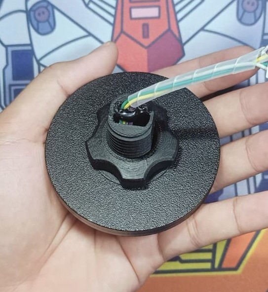
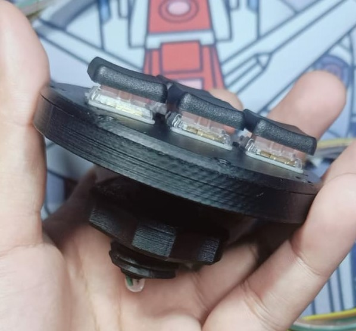
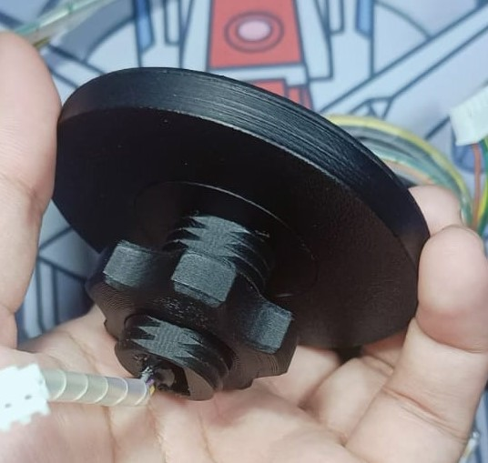
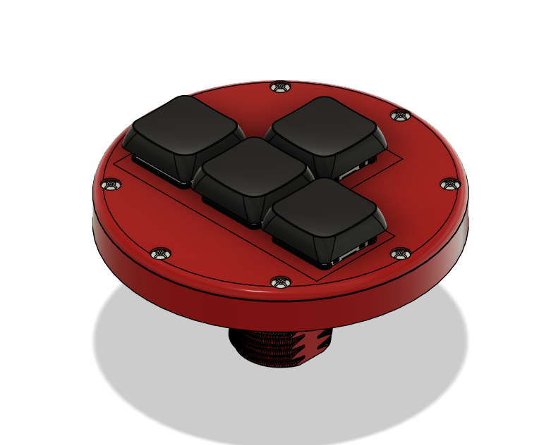
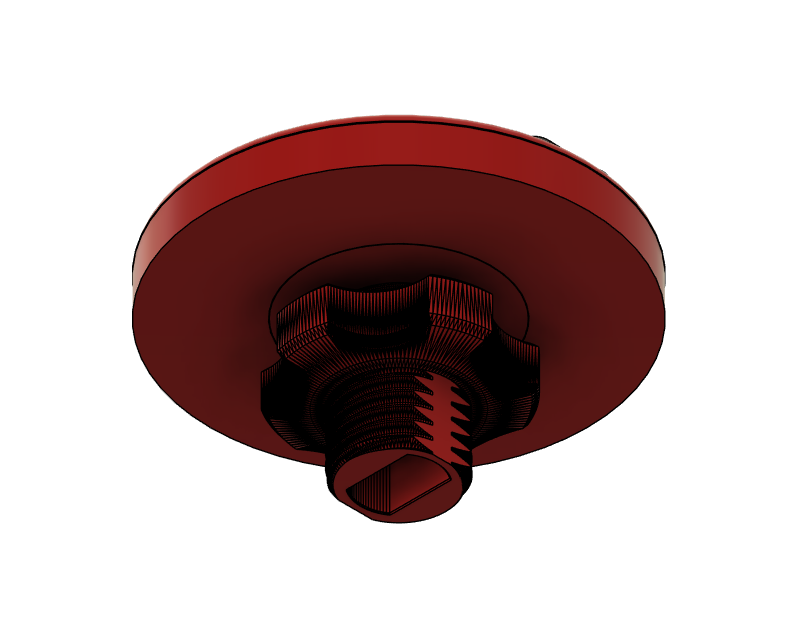
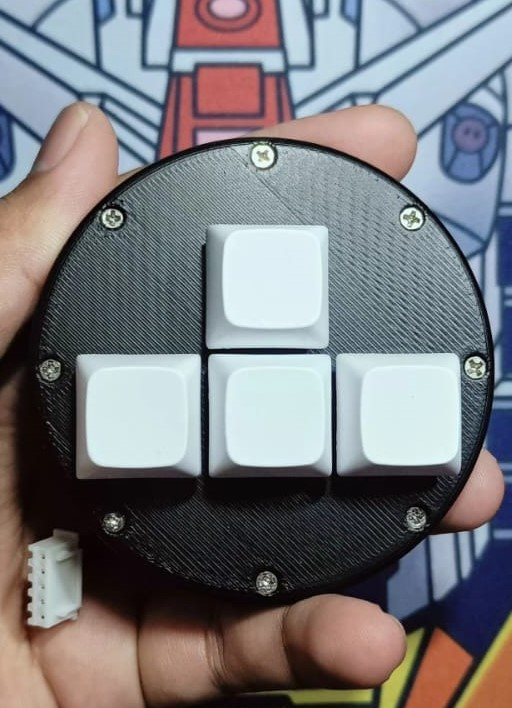
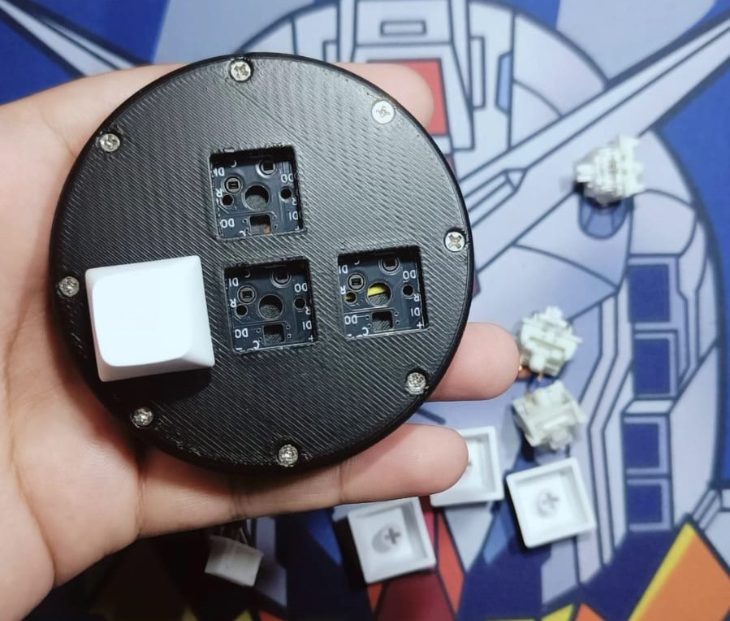
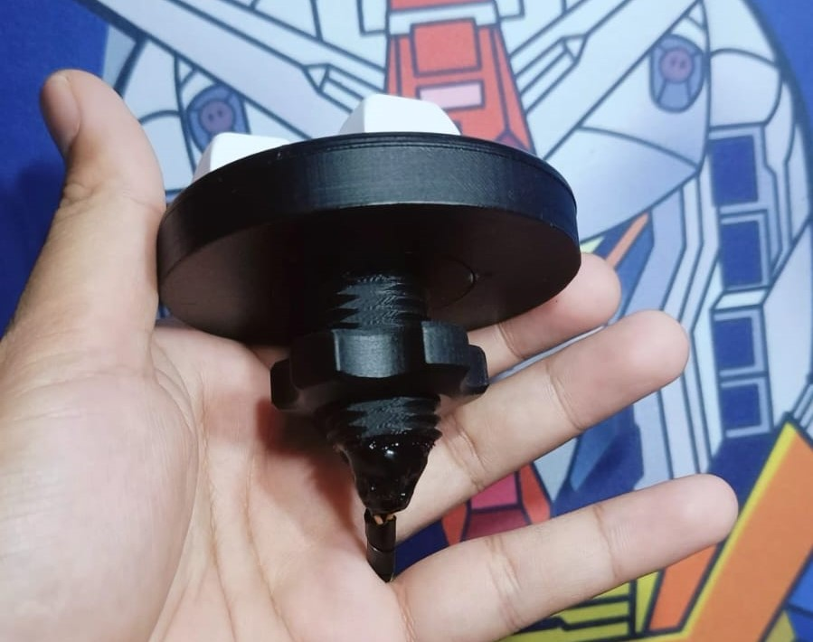
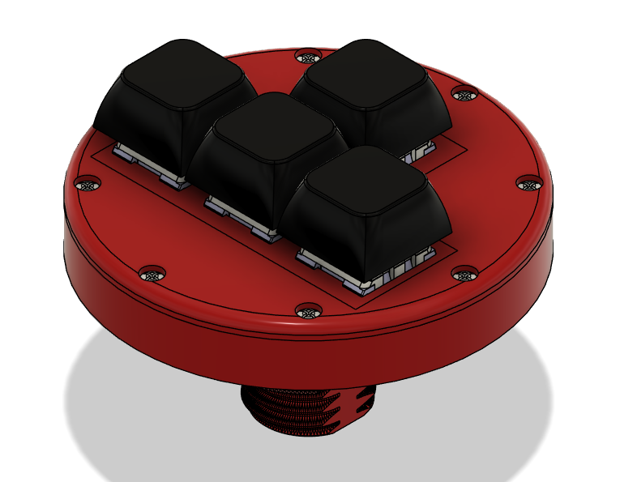
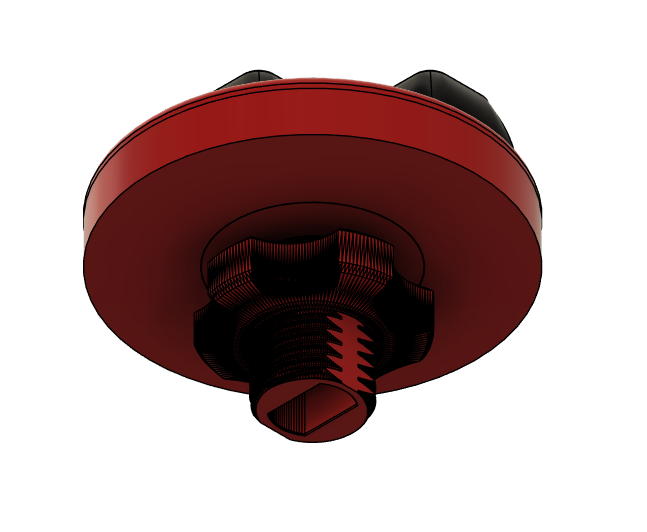

# WASDBOX-add-on-Arcade-Controller

## Pinout Cabel Extension
- Black = Ground
- Orange = Left
- Yellow = Right
- Green = Down
- Brown = UP

## Preview Product WASDBOX

    
    
          
    

## Preview Design WASDBOX

    
    
    

## Preview Product WASDBOX MX

    
    
    

## Preview Design WASDBOX MX

    
    
    

## Preview Product WASDBOX MX with THUMB

    

## Preview Design WASDBOX MX with THUMB

    
    
    

